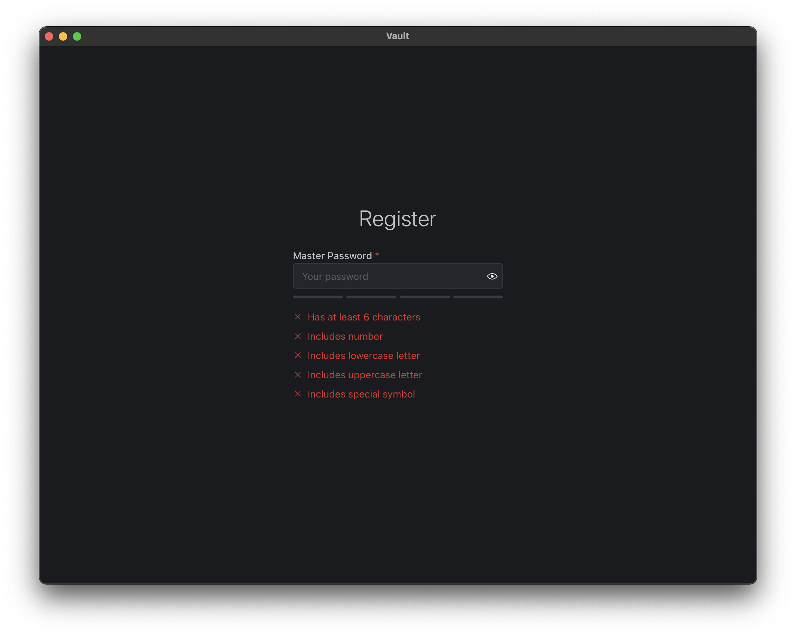
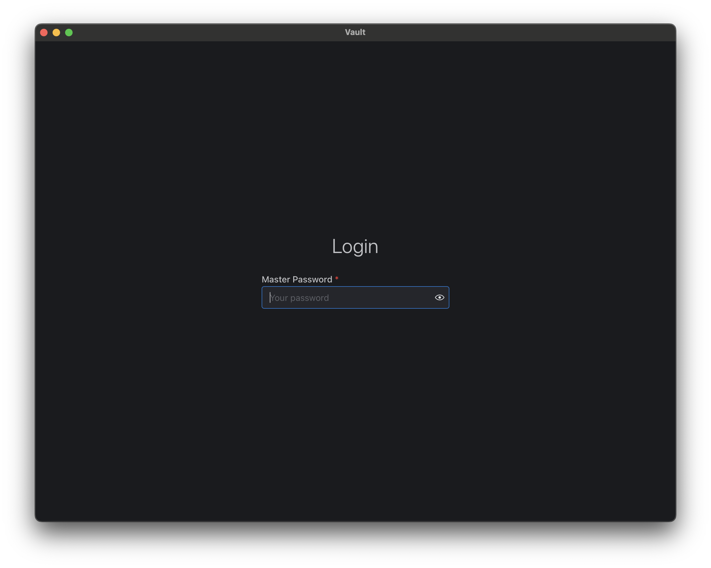
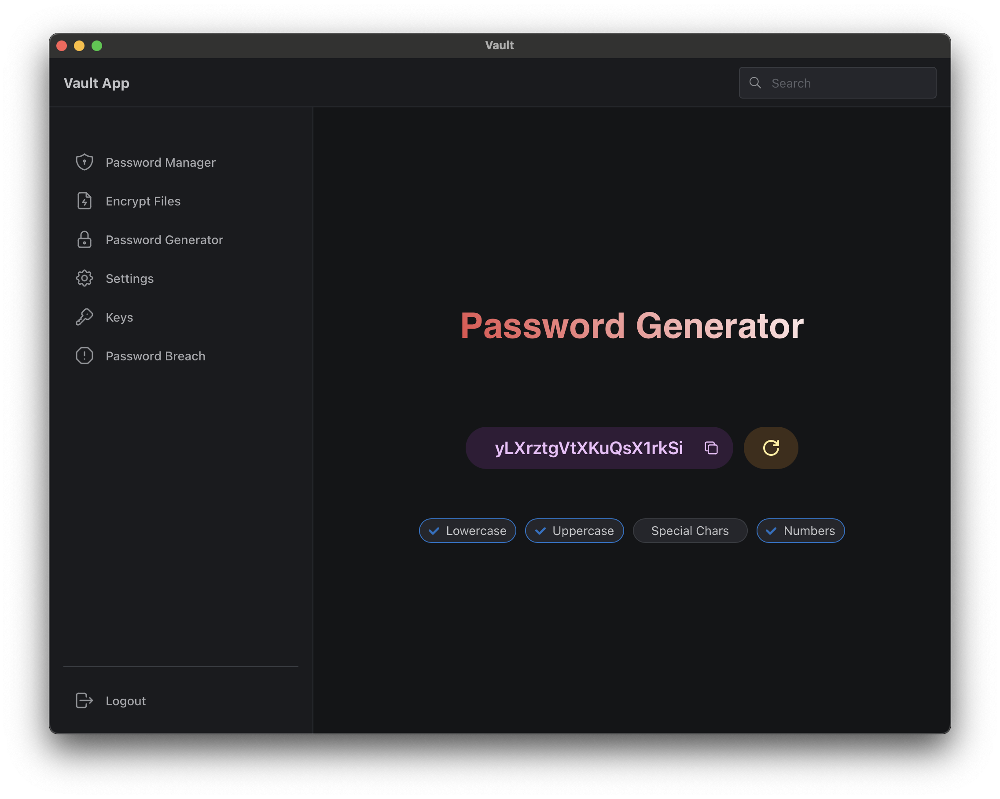
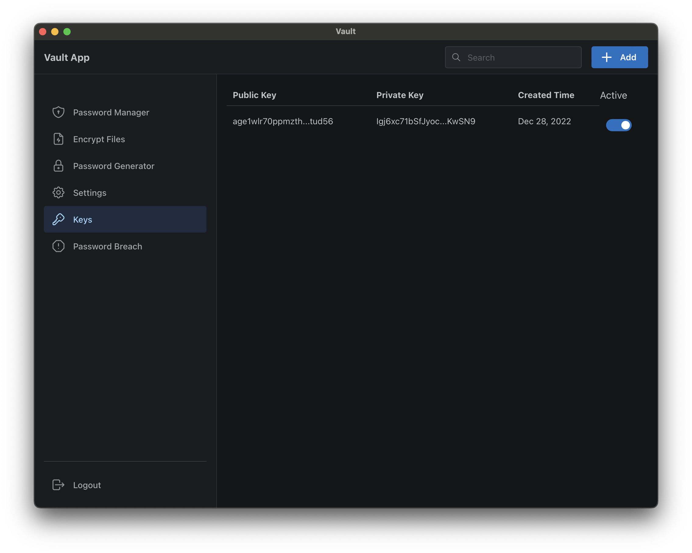
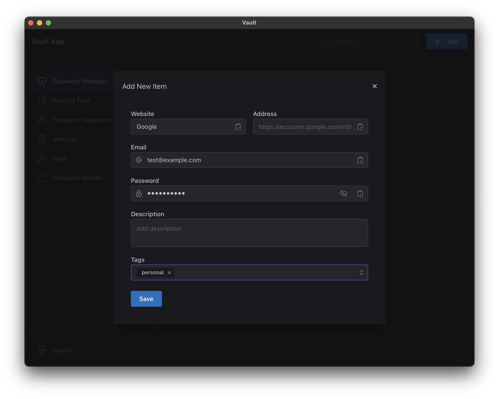
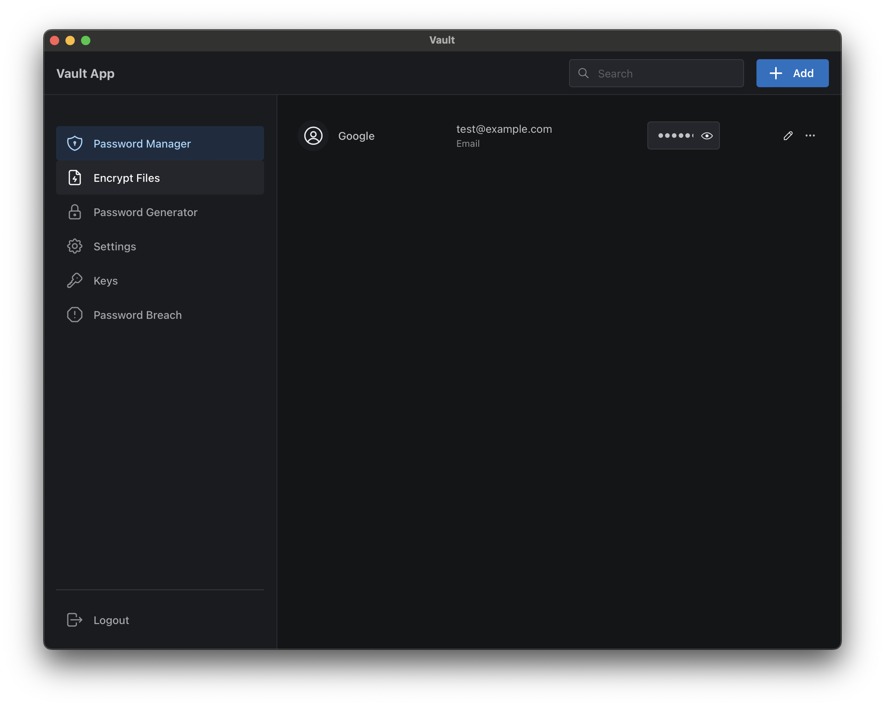

# Vault App

Keep your secrets secret.

## Screenshots

## Features to implement

- [x] Random Password Generator
- [x] Password Manager
- [ ] Secure Notes (Encrypted)
- [ ] Encrypt Files / Directories

## TODO

- Remove all things from `routes.ts` file
  - Mangage all routes in `createHashRouter` function
- Improve UI for master password entry
  - Add validation when registering for the first time
- User should be able to update the master password
  - It requires re-encrypting all the private keys with the new master password
- Show error when no active age key found

### Authentication

- [x] Master key
- [x] Encrypt other keys with the master key
- [ ] Adding a key requires entering the master key
- [ ] UI for the master key!
